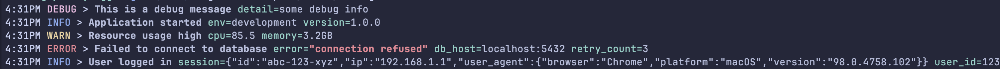

# Slog Pretty Logger

[](https://github.com/nentgroup/slog-prettylogger/actions/workflows/test.yml)
[](https://raw.githack.com/wiki/nentgroup/slog-prettylogger/coverage.html)
[](https://pkg.go.dev/github.com/nentgroup/slog-prettylogger)
[](https://goreportcard.com/report/github.com/nentgroup/slog-prettylogger)
[](https://raw.githubusercontent.com/rs/zerolog/master/LICENSE)

A colourful, readable logging handler for Go's standard `slog` package. Makes logs easier to read during development with colour-coded levels and clean formatting. Inspired by zerolog's console output.

## Features

- <picture><source media="(prefers-color-scheme: dark)" srcset="./.github/assets/icons/chart-dark.svg" width="16" height="16"></picture> **Color-coded levels**: DEBUG, INFO, WARN, ERROR
- <picture><source media="(prefers-color-scheme: dark)" srcset="./.github/assets/icons/highlight-dark.svg" width="16" height="16"></picture> **Bold messages**: Highlights log messages and errors
- <picture><source media="(prefers-color-scheme: dark)" srcset="./.github/assets/icons/document-dark.svg" width="16" height="16"></picture> **Field formatting**: Formats fields based on type
- <picture><source media="(prefers-color-scheme: dark)" srcset="./.github/assets/icons/clock-dark.svg" width="16" height="16"></picture> **Custom time**: Override the default `time.Kitchen` format
- <picture><source media="(prefers-color-scheme: dark)" srcset="./.github/assets/icons/ban-dark.svg" width="16" height="16"></picture> **No-color mode**: Disable ANSI colors
- <picture><source media="(prefers-color-scheme: dark)" srcset="./.github/assets/icons/palette-dark.svg" width="16" height="16"></picture> **Custom colors**: Set your own colors per log level


## Installation

```bash
go get github.com/nentgroup/slog-prettylogger
```

## Usage

```go
package main

import (
	"log/slog"
	"os"
	"time"

	"github.com/nentgroup/slog-prettylogger"
)

func main() {
	// Create a new pretty logger
	logger := slog.New(prettylogger.NewHandler(os.Stdout, prettylogger.HandlerOptions{
		SlogOpts: slog.HandlerOptions{
			AddSource: true, // Include caller information
			Level:     slog.LevelDebug,
		},
		TimeFormat: time.TimeOnly, // Customise time format, default is time.Kitchen
	}))

	// Set as default logger
	slog.SetDefault(logger)

	// Basic logging
	slog.Info("application started", "version", "1.0.0")
	slog.Debug("debug information", "cache_hits", 42)
	slog.Warn("resource usage high", "cpu", 85.5, "memory", "3.2GB")
	slog.Error("failed to connect to database",
		"error", "connection refused",
		"retry_count", 3,
		"db_host", "localhost:5432")

	// With structured data
	logger.Info("user logged in",
		"user_id", 123,
		"metadata", map[string]interface{}{
			"browser":  "Chrome",
			"version":  "98.0.4758.102",
			"platform": "macOS",
		})
}
```

## Output Example

When using pretty logger, your console output will look similar to:



## Configuration Options

Use the `HandlerOptions` struct to customise the logger:

```go
type HandlerOptions struct {
    SlogOpts    slog.HandlerOptions        // Standard slog handler options (level, AddSource, etc.)
    TimeFormat  string                     // Optional: custom time format (default is time.Kitchen)
    NoColor     bool                       // Optional: disable ANSI colors
    LevelColors map[slog.Level]string      // Optional: override colors per log level (DEBUG, INFO, WARN, ERROR)
}
```

### Example with custom colors

```go
logger := slog.New(prettylogger.NewHandler(os.Stdout, prettylogger.HandlerOptions{
	SlogOpts: slog.HandlerOptions{
		AddSource: true,
		Level:     slog.LevelDebug,
	},
	TimeFormat:  time.RFC3339,
	LevelColors: map[slog.Level]string{slog.LevelError: prettylogger.BoldRed}, // or use any ANSI colour code
}))
```

## Contributing

Contributions are welcome! Please feel free to submit a Pull Request.

## Acknowledgements

Developed and maintained by [Viaplay Group](https://github.com/nentgroup).
